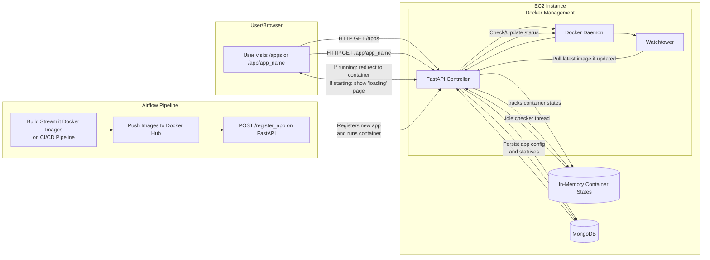

# QuLabs-Backend

This FastAPI application manages dynamic Streamlit containers, with idle-timeout and MongoDB integration.

## Local Development

1. **Install dependencies**:
   ```bash
   pip install -r requirements.txt
   ```

2. Set up MongoDB (ensure MONGO_URI in main.py points to your Mongo instance).


## Endpoints

- `POST /register_app` – Registers a new Streamlit app (with Docker image, port, etc.) and starts it.
- `GET /apps` – Lists all registered apps from Mongo.
- `DELETE /apps/{app_name}` – Removes an app from Mongo and stops/removes the container.
- `GET /app/{app_name}` – Entry point for users. If running, redirects to the Streamlit container. Otherwise, shows a loading page with auto-refresh.
- `GET /status/{app_name}` – Polled by the loading page to detect readiness.

# Deployment

Run this command to start the docker container
```
docker run -d \
  -e MONGO_URI="<MONGO_URI>" \
  -e MONGO_DB="test" \
  -p 8001:8001 \
  qunikamshreyas/qulabs-backend:latest
```

Run this command to start the watchtower
```
docker run -d \
  --name watchtower \
  -v /var/run/docker.sock:/var/run/docker.sock \
  containrrr/watchtower \
  qunikamshreyas/qulabs-backend --interval 30
```

For watching all containers:
```
docker run -d   --name watchtower-global   -e WATCHTOWER_POLL_INTERVAL=30   -e WATCHTOWER_CLEANUP=true   -v /var/run/docker.sock:/var/run/docker.sock   containrrr/watchtower --interval 30
```


## Architecture diagram:



Checks:
- [x] Image is being created on push to main branch
- [x] Latest image is beign pushed to dockerhub
- [x] Latest image is being pulled from dockerhub on latest tag
- [ ] Watchtower is polling every 30 seconds
- [ ] Watchtower is pulling the latest image
