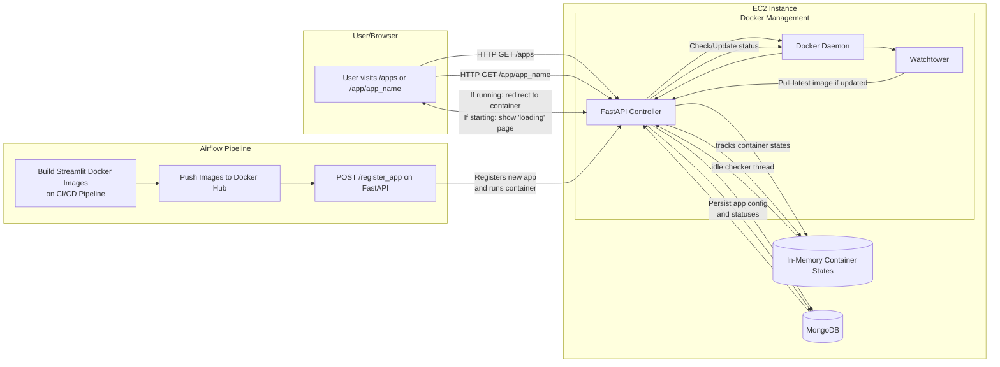

# QuLabs-Backend

This FastAPI application manages dynamic Streamlit containers, with idle-timeout and MongoDB integration.

## Local Development

1. **Install dependencies**:
   ```bash
   pip install -r requirements.txt
   ```

2. Set up MongoDB (ensure MONGO_URI in main.py points to your Mongo instance).


3. **Install claat**  
   [claat](https://github.com/googlecodelabs/tools) is used for rendering Google Codelabs.  
   - **Option A**: Download a precompiled binary from GitHub releases:  
     ```bash
     # Example: v1.0.0 is shown here; replace with the latest version from the GitHub releases
     curl -L https://github.com/googlecodelabs/tools/releases/download/v1.0.0/claat-linux-amd64 -o claat
     chmod +x claat
     sudo mv claat /usr/local/bin
     claat --help
     ```
   - **Option B**: Build from source (Go required)  
     ```bash
     git clone https://github.com/googlecodelabs/tools.git
     cd tools/claat
     go build
     mv claat /usr/local/bin
     claat --help
     ```


## Endpoints

- `POST /register_app` – Registers a new Streamlit app (with Docker image, port, etc.) and starts it.
- `GET /apps` – Lists all registered apps from Mongo.
- `DELETE /apps/{app_name}` – Removes an app from Mongo and stops/removes the container.
- `GET /app/{app_name}` – Entry point for users. If running, redirects to the Streamlit container. Otherwise, shows a loading page with auto-refresh.
- `GET /status/{app_name}` – Polled by the loading page to detect readiness.

# Deployment

Run this command to start the docker container. (Do not pull)
```
docker run -d \
  -e MONGO_URI="<MONGO_URI>" \
  -e MONGO_DB="test" \
  -p 8002:8002 \
  qunikamshreyas/qulabs-backend:latest
```

Run this command to start the watchtower
```
docker run -d \
  --name watchtower \
  -v /var/run/docker.sock:/var/run/docker.sock \
  containrrr/watchtower \
  qunikamshreyas/qulabs-backend:latest --interval 30
```

For watching all containers:
```
docker run -d   --name watchtower-global   -e WATCHTOWER_POLL_INTERVAL=30   -e WATCHTOWER_CLEANUP=true   -v /var/run/docker.sock:/var/run/docker.sock   containrrr/watchtower --interval 30
```


## Architecture diagram:



Checks:
- [x] Image is being created on push to main branch
- [x] Latest image is beign pushed to dockerhub
- [x] Latest image is being pulled from dockerhub on latest tag
- [x] Watchtower is polling every 30 seconds
- [x] Watchtower is pulling the latest image
- [x] The latest image is being served


(For deployment):
Add this to nginx:
```
location ~ ^/documentation/([^/]+)/ {
              alias /var/www/codelabs/$1/;
              autoindex off;
              try_files $uri $uri/ /index.html =404;
      }

location / {
                proxy_pass http://localhost:8002;
                proxy_http_version 1.1;
                proxy_set_header Upgrade $http_upgrade;
                proxy_set_header Connection 'upgrade';
                proxy_set_header Host $host;
                proxy_set_header Origin '';
                proxy_cache_bypass $http_upgrade;
        }

include /etc/nginx/conf.d/labs/*.conf;
```

### Add this to add_lab.sh in /usr/local/bin/add_lab.sh
```
#!/usr/bin/env bash
LAB_ID=$1
PORT=$2

# Example usage: ./add_lab.sh lab123 8501

CONF_DIR="/etc/nginx/conf.d/labs"
CONF_FILE="$CONF_DIR/${LAB_ID}.conf"

# Create the labs directory if it doesn't exist
sudo mkdir -p "$CONF_DIR"

# Write the config snippet
sudo bash -c "cat > $CONF_FILE" <<EOF
location /${LAB_ID}/ {
    proxy_pass http://localhost:${PORT};

    proxy_http_version 1.1;
    proxy_set_header Upgrade \$http_upgrade;
    proxy_set_header Connection "upgrade";
    proxy_set_header Host \$host;
    proxy_cache_bypass \$http_upgrade;
}
EOF

# Test Nginx config
if sudo nginx -t; then
  # Reload only if test is successful
  sudo systemctl reload nginx
  echo "Nginx config for ${LAB_ID} added and reloaded successfully."
else
  echo "Nginx config test failed! Reverting changes..."
  # Remove the conf file we just created
  sudo rm -f "$CONF_FILE"
fi
```